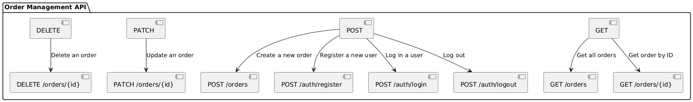
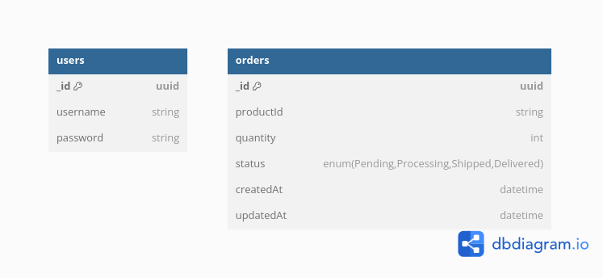

# Order Management API

A RESTful API for managing orders in an e-commerce application, built with Node.js and MongoDB.

## Table of Contents

- [Order Management API](#order-management-api)
  - [Table of Contents](#table-of-contents)
  - [Features](#features)
  - [Getting Started](#getting-started)
  - [API Documentation](#api-documentation)
  - [Database Schema](#database-schema)
  - [Docker Usage (Optional)](#docker-usage-optional)
  - [Run the App](#run-the-app)

## Features

- CRUD operations for managing orders
- User registration, login, and authentication with JWT
- Error handling and validation
- API documentation with Swagger
- Environment variable support
- Optional Docker support for containerized setup

## Getting Started

1. **Clone the repository:**

   ```bash
   git clone https://github.com/Oluwaseg/order-management.git
   cd order-management
   ```

2. **Install dependencies:**

   ```bash
   npm install
   ```

3. **Environment Variables:**

   Create a `.env` file in the project root with the following variables:

   ```env
   PORT=
   MONGODB_URL=
   JWT_SECRET=
   ```

## API Documentation

The API documentation is available via Swagger. You can access it at:

```
http:///api/v1/docs
```



## Database Schema

The database schema is designed to support order and user management efficiently.



## Docker Usage (Optional)

This API can be run within a Docker container.

1. **Build the Docker image:**

   ```bash
   docker build -t order-management-api .
   ```

2. **Run the Docker container:**

   ```bash
   docker run -p 5000:5000 order-management-api
   ```

If you have a `.env` file, Docker Compose can be set up to automatically load the environment variables for easier container management.

## Run the App

To start the app without Docker:

```bash
npm start
```

The API will be available at ``.
